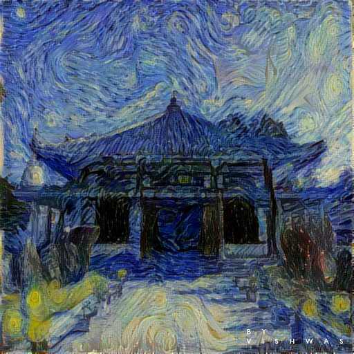
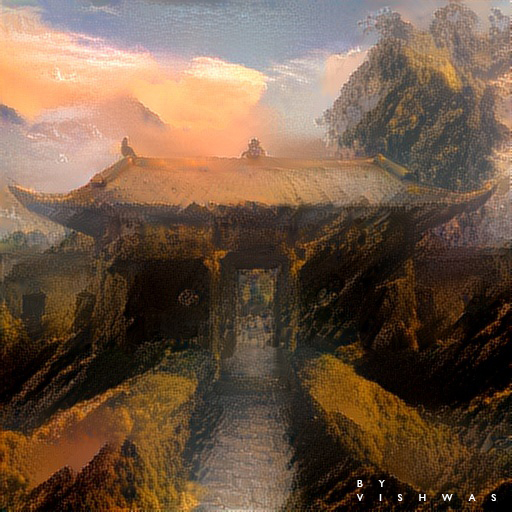
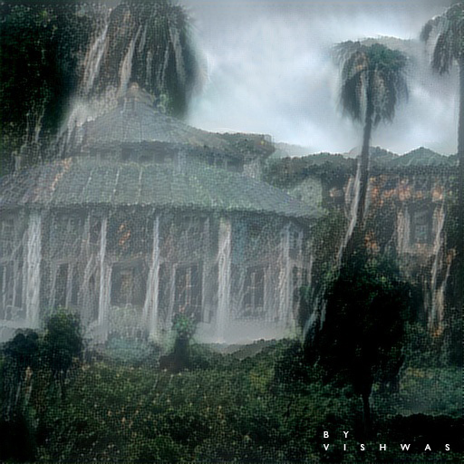

# Neural_Style_Transfer

Neural Style Transfer using **Transfer Learning** in Keras and Tensorflow :smile:

There is only one **python** file which is [main_utils](https://github.com/vstark21/Neural_Style_Transfer/blob/master/main_utils.py) which contains functions and a **notebook** file [main.ipynb](https://github.com/vstark21/Neural_Style_Transfer/blob/master/main.ipynb) in which functions are used.

## Results

|                        Content Images                        |                         Style Images                         |                           Results                            |
| :----------------------------------------------------------: | :----------------------------------------------------------: | :----------------------------------------------------------: |
|  |  |  |
|  |  |  |
|  |  |  |

## How it works

I have used a **VGG16** which is a pretrained CNN model which contains 16 layers (*VGG19 contains 19 layers*) and passed a content image, a style image and a generated image (*randomly generated or may be initialized one of content or style image*) through the model.

#### Losses

* **Content Loss -** chose a layer from the layers of model and used that layer of content image and generated image to calculate content loss. Minimizing this loss tries build the outline of content image in generated image.
* **Style Loss -** chose 5 layers from the layers of model and used those layers of style image and generated image to calculate style loss. Minimizing  this loss tries to build the style of style image in generated image.

* **Variation Loss -** to reduce noise in the generated image we calculate variation loss
* **Total Loss -** And finally we calculate weighted sum of all losses and minimize it.

#### Optimizer

As mentioned in the [research paper](https://arxiv.org/abs/1508.06576) by **Leon Gatys**, I have used BFGS algorithm (*An Iterative Nonlinear optimization method*) of scipy to minimize loss. Instead we can also use adam optimzer or any other to minimize loss.

####  Choosing layers

**Content Layer**

​	As I have initialized generated image with content image, I have an option to choose content layer from anywhere in the model. 	If we initialize generated image randomly then we always need to choose layers in the beginning of the model so that generated image can learn **minor details** (*Such as lines, ...etc.*) from the content image.

**Style Layers**

​	There are no constraints to choose style layers we can choose from anywhere in the model.

## Conclusion

Results will be **pretty interesting** when we select a good style for a given content image :v:.

    &copy <a href="https://github.com/vstark21">V I S H W A S</a>

